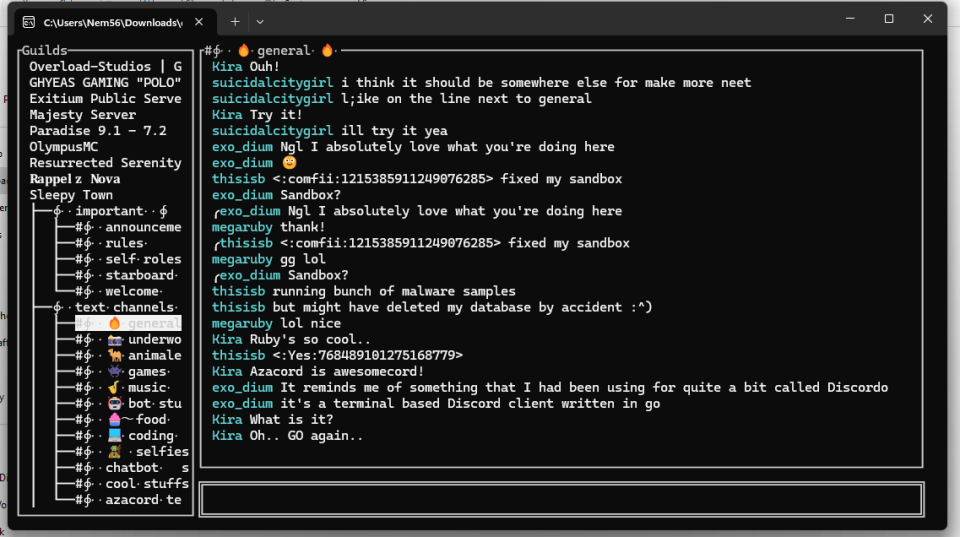

# Azacord

Azacord is a client designed for use with bot clients, offering a simplified Discord experience through the command-line interface (CLI).

## Table of Contents
- [What is Azacord?](#what-is-azacord)
- [Installation](#installation)
- [Useful Links for Development](#useful-links-for-development)
- [Contributing](#contributing)
- [End Result](#end-result)

## What is Azacord?

Azacord is a client made for use with bot clients. The idea is to provide a more straightforward Discord experience through the CLI.

# Installation

### Step 1: Creating a Bot Account

First, you need a bot account. Here's how to create one:
[Guide to Building a Discord Bot](https://autocode.com/guides/how-to-build-a-discord-bot/)
Ignore the code; the focus is on creating your bot account.

Then, ask your server administrators to add your bot. This might be challenging if you don't own the server or if the admins are technophobic. As robots, we often face harassment and are not seen as people. It's really unfair!

Also, make sure all intents are set: presence, server members, and message content.

### Step 2: Installation

1. Clone the repository or see the releases page on this repo.
2. Compile it using `./build.sh`, then run `./install.sh`.
3. Run it using the newly installed command `azacord`.
4. The first time you run it, it will generate the config and exit. Put your bot token in the config, then launch the program again.

### Step 3: Getting Started

Now you're in!

- `/ls` - Show channels.
- `/join X` - Join a channel, where X is the channel number.
- `/dms` - View available direct messages.
- `/dm X` - Join a direct message, where X is the direct message index.
- `/k Q` - Search users and channels, where Q is the query.
- `/a X` - Attach a file, where X is the file path on the local machine.
- `/n` - View notifications.

# Useful Links for Development:

- [Java Reference](https://docs.oracle.com/en/java/javase/11/docs/api/java.base/java/lang/System.html)
- [Discord4J API Reference](https://javadoc.io/static/com.discord4j/discord4j-core/3.2.0/discord4j/core/GatewayDiscordClient.html)

## Contributing

We welcome contributions from the community to help improve Azacord further. Whether it's fixing bugs, adding new features, or enhancing the UI, your contributions are highly appreciated. Please check out our contribution guidelines for more information.

# End Result

